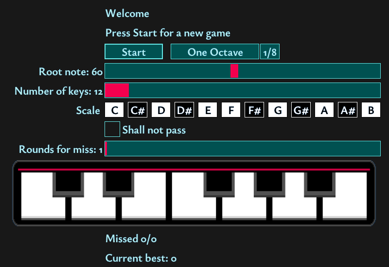

 
Simon game, with MIDI input (to connect to a keyboard or other instrument) and MIDI output (to offload sound generation). As a standalone or audio plugin thanks to [DPF](https://github.com/DISTRHO/DPF/).

Can be used online (PWA-enabled): https://jfrey-xx.github.io/simon-piano/simon-piano.html -- on mobile pairs nicely with MIDI BLE devices, e.g. on Android through [MIDI BLE Connect](https://play.google.com/store/apps/details?id=com.mobileer.example.midibtlepairing).

# Notes

During instructions defaults to first MIDI channel and full velocity, while playing keep those variables intact.

Only note on/off messages are passed through.

# Dev

Tested on Linux x64 (Ubuntu 24.04) with GLES2 and GL33, MacOS intel (10.15) with GLES2 and GL33 (if you wish to switch to GL33, sync flags for DPF in the main `Makefile` and for raylib in `src/Makefile.rayui.mk`).

## web export

- install emsdk (tested with 4.0.6 running on Ubuntu 24.04)
- `emsdk activate`
- `source "/location/to/emsdk/emsdk_env.sh"`
- `CXX=em++ CC=emcc make`

# TODO

- debounce for MIDI input?
- someday: a version with chords?

# Known issues

- upon closing the plugin notes if active will get stuck
